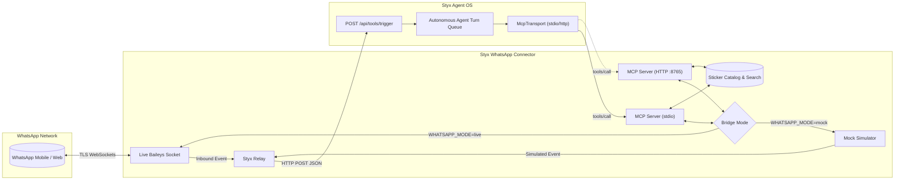

# @styx-tools/whatsapp

[](https://github.com/styx-ai/styx)
[](https://modelcontextprotocol.io)
[](LICENSE)

> Isolated Bi-Directional WhatsApp Connect Micro-Daemon & MCP 2024-11-05 Server for **Styx Agent OS**.

---

## Table of Contents

- [Overview & Architecture](#overview--architecture)
- [Key Features](#key-features)
- [Security Isolation Principles](#security-isolation-principles)
- [Quick Start](#quick-start)
- [Bridge Modes](#bridge-modes)
  - [1. Offline Mock Simulator (Default)](#1-offline-mock-simulator-default)
  - [2. Live Baileys WhatsApp Connection](#2-live-baileys-whatsapp-connection)
- [Sticker Catalog & Emotional Tone Etiquette](#sticker-catalog--emotional-tone-etiquette)
- [Bi-Directional Styx Relay](#bi-directional-styx-relay)
- [Model Context Protocol (MCP 2024-11-05) Server](#model-context-protocol-mcp-2024-11-05-server)
  - [Stdio Transport](#stdio-transport)
  - [HTTP Transport](#http-transport)
  - [Registered Tools](#registered-tools)
- [CLI Reference (`bin/styx-whatsapp`)](#cli-reference-binstyx-whatsapp)
- [Styx Auto-Registration](#styx-auto-registration)
- [Docker Deployment](#docker-deployment)
- [Testing](#testing)

---

## Overview & Architecture

`@styx-tools/whatsapp` bridges WhatsApp messaging with **Styx Agent OS** through:
1. **Inbound Event Push:** Pushing real-time incoming WhatsApp messages to Styx's reactive endpoint (`POST /api/tools/trigger`), spawning dedicated agent sessions and queued turns.
2. **Outbound Tool Execution:** Exposing high-level MCP 2024-11-05 tools (`send_message`, `send_sticker`, `find_stickers`, `send_reaction`) so the autonomous Styx agent can formulate responses, perform emotional sticker lookups, and interact with human contacts.



---

## Key Features

- **Dual-Mode Bridge:** Switch effortlessly between an offline mock simulator (for automated testing and local development without WhatsApp credentials) and live multi-device WhatsApp Web connectivity via `@whiskeysockets/baileys`.
- **QR Terminal Pairing:** Interactive QR code rendering directly in your terminal for WhatsApp Linked Devices pairing.
- **Bi-Directional Styx OS Relay:** Inbound WhatsApp messages are instantly structured as `InboundToolEventRequest` payloads and delivered to Styx OS at `POST /api/tools/trigger`.
- **Tone-Compliant Sticker Engine:** Implements the sticker and emotional context search protocol specified in `instructions.md` (e.g. prioritizing cat/animal decline reactions, shrugs, and celebrations).
- **Full MCP 2024-11-05 Specification:** Exposes tools over standard line-delimited `stdio` JSON-RPC 2.0 (for direct Styx child process spawning) and `HTTP` transport (for containerized / background daemon setups).
- **Auto-Registration Command:** One-line command to register this MCP tool server into Styx OS (`bin/styx-whatsapp register`).
- **Security Sandboxing:** Enforces POSIX `0700` permission lockdown on session keys, redacts sensitive tokens in Pino logs, and routes logs exclusively to `stderr` to ensure `stdout` is pristine for JSON-RPC.

---

## Security Isolation Principles

1. **Session Credentials Isolation:** Multi-device WhatsApp credentials in `./.auth_session` are explicitly ignored by `.gitignore` and enforced with POSIX `0700` (`rwx------`) permissions at runtime.
2. **Clean JSON-RPC Protocol Transport:** All Pino logs, diagnostics, and pairing QR codes are routed strictly to `process.stderr`. `process.stdout` is strictly reserved for JSON-RPC 2.0 frames.
3. **Secret Redaction:** Auth tokens, passwords, keys, and `STYX_ACCESS_KEY` are automatically sanitized and redacted by the internal logger.

---

## Quick Start

### 1. Install & Configure

```bash
# Clone and enter directory
git clone git@github.com:GoVed/styx-whatsapp.git
cd styx-whatsapp

# Copy environment template
cp .env.example .env
```

Edit `.env` to configure your settings:

```ini
WHATSAPP_MODE=mock
WHATSAPP_AUTH_DIR=./.auth_session
STYX_API_URL=http://localhost:3000
STYX_ACCESS_KEY=styx-local-dev-key
HTTP_PORT=8765
```

### 2. Run Tests

```bash
npm test
```

---

## Bridge Modes

### 1. Offline Mock Simulator (Default)

Requires no physical phone, SIM, or internet connection. Perfect for CI/CD, agent prompt testing, and development:

```bash
# Run daemon in mock mode
npm run dev

# Or with CLI
./bin/styx-whatsapp daemon --mode mock
```

### 2. Live Baileys WhatsApp Connection

Connects to actual WhatsApp via Baileys multi-device socket:

```bash
# 1. Pair your WhatsApp account
npm run login

# A QR code will display on terminal stderr.
# Open WhatsApp on your phone -> Settings -> Linked Devices -> Link a Device -> Scan QR.

# 2. Start the daemon in live mode
./bin/styx-whatsapp daemon --mode live
```

---

## Sticker Catalog & Emotional Tone Etiquette

Governed by `instructions.md`, the connector features a ranked search engine:
- Operator style: Brief, lowercase-friendly, emotional sticker reactions.
- Declining invites: Evaluates schedule commitments, then searches for apologetic or animal decline stickers (e.g. `cat_sad_crying`).
- Acknowledging / Celebrating: Searches for approval (`cat_thumbs_up`, `thumbs_up_classic`) or excitement (`cat_celebrate`, `fire_lit`, `party_popper`).

### Searching via CLI

```bash
# Search for sad cat
./bin/styx-whatsapp stickers "sad cat"

# Search for shrug
./bin/styx-whatsapp stickers "shrug"

# List all stickers in catalog
./bin/styx-whatsapp stickers
```

---

## Bi-Directional Styx Relay

When an incoming message arrives, the relay formats and dispatches a POST request to Styx:

```http
POST /api/tools/trigger HTTP/1.1
Host: localhost:3000
Content-Type: application/json
Authorization: Bearer <STYX_ACCESS_KEY>
X-Styx-Access-Key: <STYX_ACCESS_KEY>

{
  "protocol": "whatsapp",
  "event_type": "new_message",
  "source_id": "Alice (+1234567890)",
  "session_id": null,
  "payload": {
    "from": "+1234567890",
    "sender_name": "Alice",
    "sender_jid": "1234567890@s.whatsapp.net",
    "message": "Hey, free for coffee tomorrow morning?",
    "timestamp": 1727480000,
    "message_id": "WA_MSG_12345",
    "is_group": false,
    "chat_jid": "1234567890@s.whatsapp.net"
  }
}
```

Styx Agent OS receives this, automatically generates a session titled `[WHATSAPP] Alice (+1234567890)`, loads memory skills (`skills/whatsapp.md`), and queues an agent inference turn!

---

## Model Context Protocol (MCP 2024-11-05) Server

### Stdio Transport

Runs standard line-delimited JSON-RPC over `stdin` and `stdout`:

```bash
./bin/styx-whatsapp mcp
```

### HTTP Transport

Runs Express HTTP server at `http://127.0.0.1:8765`:
- `POST /mcp` or `POST /`: JSON-RPC 2.0 handler for Styx `McpTransport::connect_http`
- `GET /health`: Healthcheck endpoint
- `GET /status`: Detailed bridge state and configuration
- `GET /stickers`: REST query endpoint for stickers
- `POST /trigger`: Inbound webhook simulator

### Registered Tools

| Tool Name | Parameters | Description |
|-----------|------------|-------------|
| `find_stickers` | `search` *(str)*, `category` *(str?)*, `limit` *(num?)* | Searches sticker catalog by emotional context & tags. |
| `send_sticker` | `to` *(str)*, `sticker_id` *(str)* | Dispatches a sticker to a WhatsApp contact or group. |
| `send_message` | `to` *(str)*, `message` *(str)* | Sends plain text WhatsApp message. |
| `send_reaction` | `to` *(str)*, `message_id` *(str)*, `emoji` *(str)* | Reacts to a message with an emoji. |
| `get_whatsapp_status` | *(none)* | Returns bridge connection status, mode, and user info. |
| `get_chat_history` | `limit` *(num?)* | Returns recent inbound/outbound chat messages. |
| `simulate_inbound_message` | `from` *(str)*, `message` *(str)*, `sender_name` *(str?)* | Injects a simulated message into Styx trigger queue. |

*(All tools are also accessible with the optional `whatsapp_` prefix, e.g. `whatsapp_send_message`.)*

---

## CLI Reference (`bin/styx-whatsapp`)

```
Usage: styx-whatsapp [options] [command]

Options:
  -V, --version                output the version number
  -h, --help                   display help for command

Commands:
  daemon [options]             Start background daemon (bridge + HTTP MCP server + Styx relay)
  mcp [options]                Start stdio MCP 2024-11-05 Server for direct subprocess piping
  login                        Pair WhatsApp Web terminal QR code in live mode and save credentials
  status [options]             Display status of WhatsApp bridge and local session credentials
  trigger [options]            Simulate an incoming WhatsApp message and dispatch it to Styx Agent OS
  register [options]           Auto-register this WhatsApp MCP server directly into Styx
  stickers [options] [search]  Query the sticker catalog (supporting emotional context search)
```

---

## Styx Auto-Registration

Register this connector directly into a running Styx Agent OS instance:

```bash
# Register using stdio transport (Styx launches child process directly)
./bin/styx-whatsapp register --transport stdio --styx-url http://localhost:3000

# Or register using HTTP transport (when running daemon in background/Docker)
./bin/styx-whatsapp register --transport http --port 8765 --styx-url http://localhost:3000
```

---

## Docker Deployment

### Using Docker Compose

```bash
# Build and launch connector
docker compose up -d

# Check logs
docker compose logs -f

# Check health
curl http://localhost:8765/health
```

---

## Testing

Run the full end-to-end test suite:

```bash
npm test
```

The test suite validates:
1. Sticker catalog relevance scoring and fallback WebP buffer generation.
2. WhatsApp mock bridge lifecycle and message recording.
3. Bi-directional Styx relay payload schema and auth headers against a mock Styx server.
4. MCP 2024-11-05 JSON-RPC protocol compliance (`initialize`, `tools/list`, `tools/call`, error handling).
5. MCP HTTP transport endpoints (`/health`, `/status`, `/stickers`, `/mcp`, `/trigger`).
